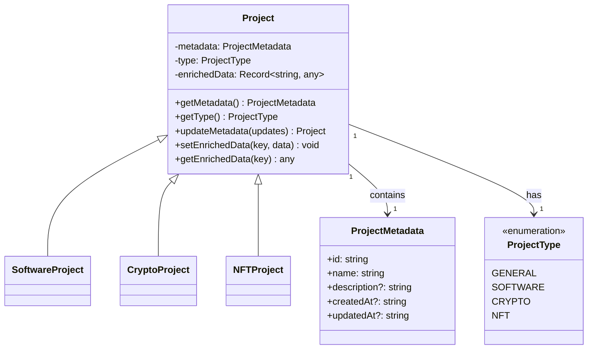
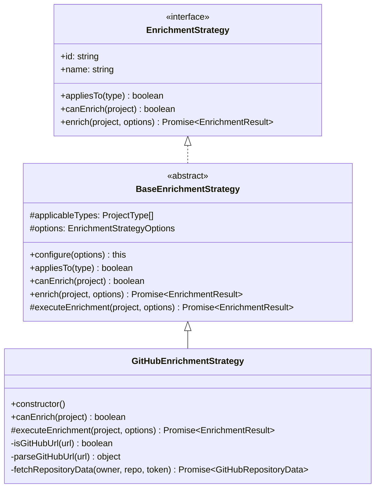
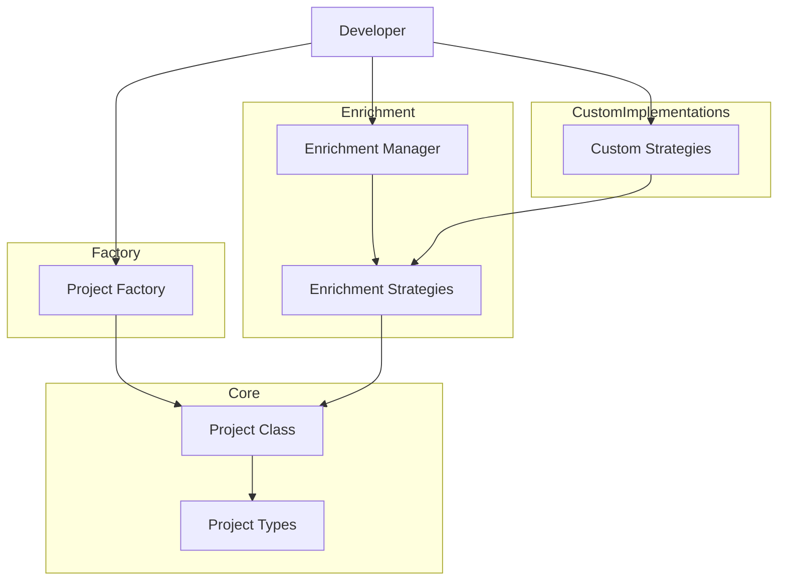
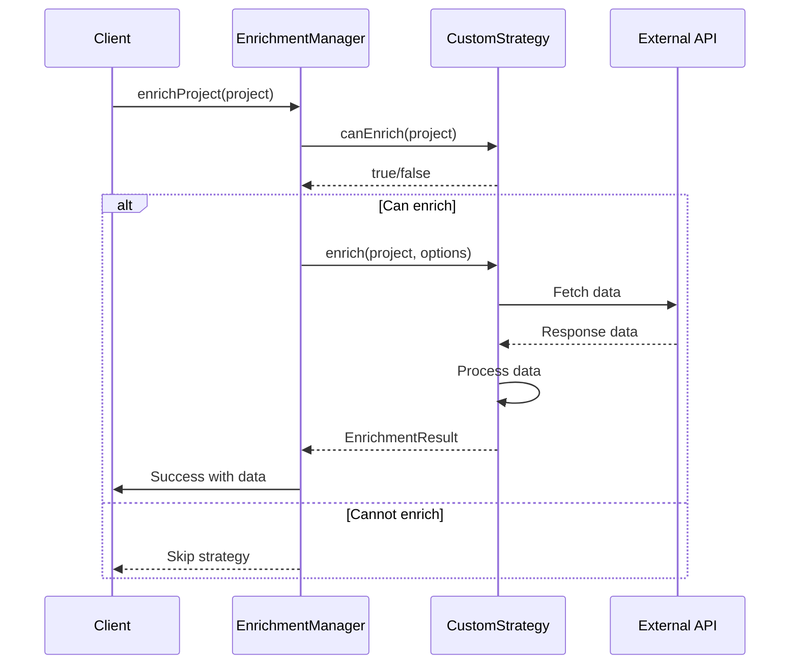

# Project Metrics Library

A flexible TypeScript framework for managing project metadata and implementing extensible enrichment strategies.

## Table of Contents

- [Overview](#overview)
- [Installation](#installation)
- [Core Concepts](#core-concepts)
  - [Project Model](#project-model)
  - [Enrichment Strategies](#enrichment-strategies)
  - [Architecture](#architecture)
- [Usage Guide](#usage-guide)
  - [Creating Projects](#creating-projects)
  - [Implementing Enrichment Strategies](#implementing-enrichment-strategies)
  - [Using the Enrichment Manager](#using-the-enrichment-manager)
- [Advanced Topics](#advanced-topics)
  - [Custom Project Types](#custom-project-types)
  - [Parallel vs Sequential Enrichment](#parallel-vs-sequential-enrichment)
- [Extending The Library](#extending-the-library)
  - [Creating New Project Types](#creating-new-project-types)
  - [Implementing New Strategies](#implementing-new-strategies)
- [API Reference](#api-reference)
- [Development](#development)
  - [Building](#building)
  - [Testing](#testing)

## Overview

`project-metrics` is a TypeScript library designed to help you manage project metadata and enrich it with data from various sources. The library follows a modular, extensible architecture that makes it easy to:

- Define projects with different types and metadata structures
- Implement custom enrichment strategies to enhance project data
- Apply these strategies selectively based on project types
- Maintain type safety throughout the enrichment process

The library is built with TypeScript generics to provide excellent type checking and IDE support when extending its functionality.

## Installation

```bash
npm install project-metrics
# or
yarn add project-metrics
```

## Core Concepts

### Project Model

At the heart of the library is the `Project` class, which serves as a container for project metadata and enriched data. Projects have:

- **Metadata**: Core information about the project (name, ID, description, etc.)
- **Type**: An identifier that categorizes the project (e.g., general, software, crypto, NFT)
- **Enriched Data**: Additional information gathered through enrichment strategies



### Enrichment Strategies

Enrichment strategies are plugins that add additional data to projects. Each strategy:

- Has a unique identifier and name
- Specifies which project types it applies to
- Contains logic to fetch and process external data
- Can be configured with options



### Architecture

The overall architecture follows a plugin-based design pattern, allowing for extensibility while maintaining a consistent interface.



## Usage Guide

### Creating Projects

You can create projects using the `ProjectFactory` to ensure type safety:

```typescript
// Import the necessary components
import { ProjectFactory } from "project-metrics";

// Create a software project
const softwareProject = ProjectFactory.createSoftwareProject({
  id: "my-project",
  name: "My Software Project",
  description: "A description of my project",
  repositoryUrl: "https://github.com/username/my-project",
  languages: ["TypeScript", "JavaScript"],
});

// Create a crypto project
const cryptoProject = ProjectFactory.createCryptoProject({
  id: "token-project",
  name: "My Token",
  symbol: "MTK",
  blockchain: "Ethereum",
  contractAddress: "0x1234...",
});
```

### Implementing Enrichment Strategies

To create a new enrichment strategy, extend the `BaseEnrichmentStrategy` class:

```typescript
import {
  BaseEnrichmentStrategy,
  EnrichmentResult,
  ProjectType,
} from "project-metrics";

interface MyStrategyOptions {
  apiKey?: string;
  timeoutMs?: number;
}

interface MyEnrichedData {
  value: string;
  timestamp: string;
}

class MyCustomStrategy extends BaseEnrichmentStrategy<
  MyEnrichedData,
  MyStrategyOptions
> {
  constructor() {
    super(
      "my-custom-strategy", // Unique ID
      "My Custom Strategy", // Human-readable name
      [ProjectType.SOFTWARE], // Applicable project types
      { timeoutMs: 5000 } // Default options
    );
  }

  // Override if you need custom logic to determine if a project can be enriched
  canEnrich(project: any): boolean {
    // Your custom logic here, e.g. check if project has specific metadata
    return super.canEnrich(project);
  }

  // Implement the actual enrichment logic
  protected async executeEnrichment(
    project: any,
    options: MyStrategyOptions
  ): Promise<EnrichmentResult<MyEnrichedData>> {
    try {
      // Fetch and process data here

      // Return successful result with the enriched data
      return {
        success: true,
        data: {
          value: "enriched value",
          timestamp: new Date().toISOString(),
        },
      };
    } catch (error) {
      return {
        success: false,
        error: error instanceof Error ? error : new Error(String(error)),
      };
    }
  }
}
```

### Using the Enrichment Manager

The `EnrichmentManager` handles the registration and application of strategies:

```typescript
import { EnrichmentManager } from "project-metrics";
import { MyCustomStrategy } from "./MyCustomStrategy";

// Create and register strategies
const myStrategy = new MyCustomStrategy();
const manager = new EnrichmentManager([myStrategy]);

// Or register them individually
manager.register(anotherStrategy);

// Apply enrichment to a project
const result = await manager.enrichProject(myProject, {
  parallel: true,
  continueOnFailure: true,
});

// Access enriched data
if (myProject.hasEnrichedData("my-custom-strategy")) {
  const data = myProject.getEnrichedData("my-custom-strategy");
  console.log(data.value);
}
```

## Advanced Topics

### Custom Project Types

You can create custom project types by extending the existing type system:

```typescript
// Extend the ProjectType enum
declare module "project-metrics" {
  interface ProjectTypes {
    CUSTOM_TYPE: "custom-type";
  }
}

// Add your custom type to the ProjectType enum
ProjectType.CUSTOM_TYPE = "custom-type" as ProjectType;

// Create custom metadata interface
interface CustomProjectMetadata extends BaseProjectMetadata {
  customField1: string;
  customField2: number;
}

// Create a project with the custom type
const customProject = ProjectFactory.createCustomProject<CustomProjectMetadata>(
  {
    id: "custom-1",
    name: "Custom Project",
    customField1: "value",
    customField2: 42,
  },
  ProjectType.CUSTOM_TYPE
);
```

### Parallel vs Sequential Enrichment

The `EnrichmentManager` supports both parallel and sequential enrichment strategies:

```typescript
// Parallel enrichment (faster but less control over order)
const parallelResult = await manager.enrichProject(project, {
  parallel: true,
});

// Sequential enrichment (slower but predictable order)
const sequentialResult = await manager.enrichProject(project, {
  parallel: false,
  continueOnFailure: true, // Continue even if some strategies fail
});

// Only apply specific strategies
const limitedResult = await manager.enrichProject(project, {
  onlyStrategyIds: ["github-repository", "my-custom-strategy"],
});

// Skip specific strategies
const filteredResult = await manager.enrichProject(project, {
  skipStrategyIds: ["slow-strategy"],
});
```

## Extending The Library

### Creating New Project Types

To add new project types to the ecosystem:

1. Define a new entry in the `ProjectType` enum
2. Create a new metadata interface that extends `BaseProjectMetadata`
3. Update the `ProjectMetadata` union type to include your new metadata interface
4. Add a factory method to `ProjectFactory` if desired

### Implementing New Strategies

To create a new enrichment strategy:

1. Define the data structure for your enriched data
2. Create any custom options your strategy needs
3. Extend `BaseEnrichmentStrategy` with your data and options types
4. Implement the `executeEnrichment` method with your enrichment logic
5. Override the `canEnrich` method if you have specific requirements

Example strategy flow:



## API Reference

### Core Classes

- **Project<T>**: The main container for project data with generic type support
- **ProjectFactory**: Static factory methods for creating different project types
- **EnrichmentStrategy<T, O>**: Interface for implementing enrichment strategies
- **BaseEnrichmentStrategy<T, O>**: Abstract base class for enrichment strategies
- **EnrichmentManager**: Manager class for registering and applying strategies

### Interfaces

- **BaseProjectMetadata**: Core metadata fields for all projects
- **CryptoProjectMetadata**: Additional fields for crypto projects
- **NFTProjectMetadata**: Additional fields for NFT projects
- **SoftwareProjectMetadata**: Additional fields for software projects
- **EnrichmentResult<T>**: Result of an enrichment operation
- **EnrichmentStrategyOptions**: Configuration options for strategies
- **EnrichmentManagerOptions**: Options for the enrichment process

### Enums

- **ProjectType**: Identifiers for different project types

## Development

### Building

```bash
# Install dependencies
npm install

# Build the library
npm run build

# Watch mode for development
npm run dev
```

### Testing

_Note: Testing capabilities will be added in future versions._

---

## License

MIT

---

_This library was developed as a flexible framework for project metadata management and enrichment strategies._
